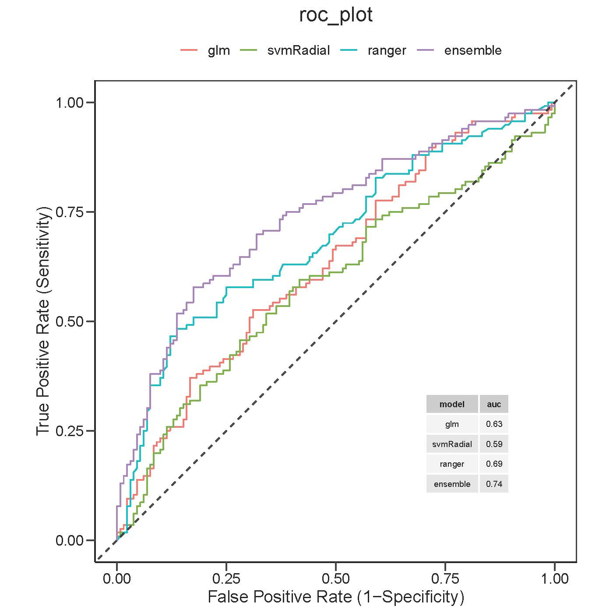
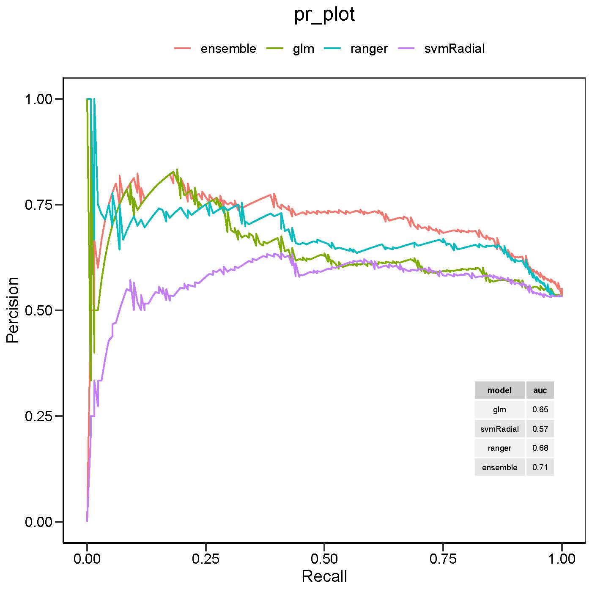
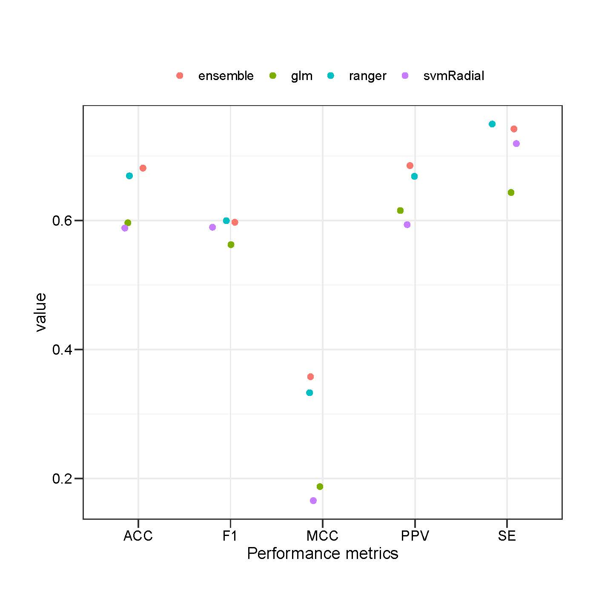

```{r setup, include = FALSE}
knitr::opts_chunk$set(echo = TRUE)
```

# Overview of MACP package
Systematic mapping of multiprotein complexes formed by protein-protein 
interactions (PPIs) can enhance our knowledge and mechanistic basis of how 
proteins function in the cells. Co-fractionation coupled with mass spectrometry 
(CF-MS) is gaining momentum as a cost-effective strategy for charting 
protein assemblies under native conditions using high-resolution 
chromatography separation techniques (e.g., size-exclusion and  ion-exchange) 
without the need for antibodies or tagging of individual proteins. 
CF-MS is initially developed for detecting native soluble human protein 
complexes from the cytosolic and nuclear extracts of cultured cells, and was 
later adapted to create the mitochondrial connectivity maps using the 
mitochondrial extracts of chemically cross-linked cultures of neuronal-like 
cells. To capture high-quality PPIs from CF-MS co-elution profile, we have 
developed a well standardized and fully automated CF-MS data analysis 
software toolkit, referred to as MACP (Macromolecular Assemblies from the 
Co-elution Profile) in an open-source R package, beginning with the processing 
of raw co-elution data to reconstruction of high-confidence PPI networks 
via supervised machine-learning.

Unlike existing software tools ([EPIC](https://github.com/BaderLab/EPIC), 
[PrInCE](https://bioconductor.org/packages/PrInCE/)), MACP facilitates CF-MS 
data analysis with flexible functions for data filtering and interaction 
scoring that can be tailored to user's needs. In addition to the similarity 
scoring measures used in EPIC, MACP utilizes ten other co-elution profile 
similarity correlation metrics over the entire co-elution profile for scoring 
and predicting native macromolecular assemblies. MACP also offers an individual 
or an ensemble classifier to enhance the quality of predicted PPIs. Notably, 
MACP toolkit includes independent functions for creating the predictive model, 
and allowing users to handle imbalanced distribution of the training data set  
(i.e., interacting and noninteracting pairs). Unlike aforesaid tools, MACP 
automatically estimates the prediction performance via a *k*-fold 
cross-validation using the training set. Lastly, due to its modular 
architecture, MACP: (1) Allows users to evaluate the model performance 
using external test sets, (2) Provides an optimized clustering procedure to 
improve the quality of predicted complexes using a grid optimization strategy, 
and (3) Offers functionalities that can be used to predict either 
mitochondrial or non-mitochondrial PPIs from various biological samples.


# MACP computational core
For each CF-MS experimental dataset, the search output derived from
database searching of co-elution proteomic experiment is summarized
into a table matrix containing relative quantification of
proteins across collected fractions. In the matrix table, rows correspond to
identified proteins, each labelled with a unique name, and relative
quantification of identified proteins for a corresponding fraction,
are represented as columns. Following converting the search results
into a compatible format, the MACP includes various data pre-processing
to improve the prediction quality, including missing value imputation,
data-noise reduction, and data normalization. Following data processing,
MACP creates possible protein pairs for each elution experiment, followed
by computing their corresponding co-elution scores via using up to 18
similarity metrics that emphasize different profile similarity aspects.
For classification purposes, the literature-curated co-complex PPIs
derived from a public database (e.g., CORUM)
are then mapped onto a feature matrix (i.e., matrix containing
similarity scores for potential protein pairs), which in turn will
be used as an input set for the built-in machine
learning algorithms to score potential proteins
pairs. The probabilistic interaction network is further denoised and finally 
partitioned using parametrized unsupervised approaches to predict putative 
complexes.


# Preparation
## Installing MACP

Installation from CRAN:
```{r, eval=FALSE}
install.packages('MACP')
```

To install the development version in R, run:
```{r, eval=FALSE}

if(!requireNamespace("devtools", quietly = TRUE)) {
install.packages("devtools")
}
devtools::install_github("BabuLab-UofR/MACP")
```

Load the package and other libraries for data manipulation:
```{r, warning=FALSE, message=FALSE}
library(MACP)
library(dplyr)
library(tidyr)
```

## Data preparation
The data files accepted by MACP are simple tables containing relative
quantification of proteins across collected fractions. The rows correspond to
identified proteins, each labelled with a unique name, and columns correspond
to fractions. To demonstrate the use of MACP, we will use a demo co-elution
data, derived from mitochondrial (mt) extracts of mouse brain culture,
fractionated by (size-exclusion chromatography, SEC). An example of CF-MS 
input data,bundled with the MACP package, can be loaded  with 
the following command:

```{r}
# Loading the demo data
data(exampleData)
dim(exampleData)
# Inspect the data 
glimpse(exampleData)
```

# MACP computational workflow: step-by-step analysis

In the following section, we will describe the major steps in MACP, 
emphasizing the arguments adjusted by the user. This includes: 
(1) Data pre-processing, (2) Protein-protein interactions (PPIs) scoring, 
(3) Prediction and network denoising, 
as well as (4) Network-based prediction of protein complexes.  


## Pre-processing

- `data_filtering` removes those proteins measured only in one 
fraction (i.e., one-hit-wonders) from further analysis. Besides the 
one-hit-wonders, MACP removes common contaminants (e.g., keratins) only for 
mouse and human organisms and 
frequent flyers (i.e., proteins observed in >80% of fractions). 
```{r}
data_p1 = data_filtering(exampleData)
# Inspect the number of retained proteins 
dim(data_p1)
```

- `impute_MissingData` imputes zero values for proteins either not 
detected by MS or not expressed in the cell by replacing missing values with an
average of adjacent neighbors (i.e., fractions) values.
```{r}
x <- data_p1
# Assign column 10 to zeros
x[,10] <- NA
data_p2 <- impute_MissingData(x)
```

- `scaling` performs column- and row-wise normalization of protein 
co-elution profile matrix to correct for sample injection 
variation and fraction bias using the command line below:

```{r}
data_p3 <- scaling(data_p1)
```

- **Optional** `keepMT` removes all the non-mitochondrial proteins by mapping the 
co-eluted proteins from chromatography fractions to MitoCarta database using 
the ensuing command. **Note that this function is only 
applicable to mouse or human organisms**. 

```{r}
data_p3 <- keepMT(data_p3)
# Inspect the number of retained proteins 
dim(data_p3)
```


## Protein-protein interactions (PPIs) scoring

The next step is to compute similarity
scores for each protein pair based on their co-elution profile, as proteins
belonging to the same protein complex is expected to co-elute in the
same or neighboring fractions, and thus will show similar elution profiles
(i.e., high similarity score). Prior to calculating correlation similarity 
metrics from co-elution profiles, MACP discards proteins that do not occur in 
the same fraction across CF-MS experiments. By default, MACP 
considers 18 metrics 
(for details, see  `calculate_PPIscore` documentation), to 
compute similarity of two protein elution profiles for all possible 
protein pairs in each CF-MS experiment using the ensuing command line. To 
further minimize the computational run time, MACP provides users with an 
option to choose an appropriate co-fractionation correlation score cut-off 
using the `corr_cutoff` argument (`apex` and `pcc_p` is 
not included), if argument `corr_removal` is set to TRUE. 

The following command can be executed to compute features for pre-processed
data:
```{r  message = FALSE, warning = FALSE}
set.seed(100)
scored_PPI <- calculate_PPIscore(data_p3,
                                corr_removal = FALSE)
```

## Prediction and network denoising

### Build reference data set
MACP uses a supervised machine learning algorithm to infer interactions; thus it
requires a set of associated external attributes (i.e., class labels) for
training purposes. To get class labels for training 
machine learning classifiers, MACP first retrieves the gold reference set 
from the [CORUM](http://mips.helmholtz-muenchen.de/corum/) database by `getCPX` 
function, followed by generating a reference set of true positive
(i.e., intra-complex) and negative interactions (inter-complex) using the 
`scored_PPI` as input via `generate_refInt` function. Also, users can submit 
their list of reference complexes. The `refcpx`, bundled with the MACP package, 
is extracted from CORUM database.


1. Load reference complexes:
```{r}
data("refcpx")
```

2. Generate class labels for interactions:
```{r}
# separate the interaction pairs
PPI_pairs <-
  scored_PPI %>%
  separate(PPI, c("p1", "p2"), sep = "~") %>% select(p1,p2)

# Generate reference set of positive and negative interactions
class_labels <-
    generate_refInt(PPI_pairs[,c(1,2)],refcpx)
table(class_labels$label)
```
**Optional** Note that if the ratio of positive to negative of training 
set is imbalanced, users can perform under-sampling
[downSample](https://www.rdocumentation.org/packages/caret/versions/6.0-90/topics/downSample)
technique to balance the ratio as the prediction works bests normally
having 1:1 or 1:5 positive to negative 
protein pairs. 

**Optional** Furthermore, if training set 
deemed insufficient, we urge users to provide MACP with suitable
reference datasets defined based on biochemical approaches collected from 
literature or other public databases (e.g., IntAct, Reactome, GO) or 
one-to-one orthologous protein mapping between human and test species of 
interest using `orthMappingCpx` function provided in the MACP package as 
follow:

```{r, eval= FALSE}
# for example to convert mouse complexes to human complexes
## load the mouse complexes
data("refcpx")
orth_mapping <- orthMappingCpx (refcpx,
  input_species = "mouse",
  output_species = "human",
  input_taxid = "10090",
  output_taxid = "9606")
```

### Protein-protein interactions (PPIs) predction 
Using input data `scored_PPI` and training data set `class_labels`, MACP 
creates a single composite probability score by combining each of the scored 
interactions from 18 different similarity measures either through an individual 
or ensemble of supervised machine-learning models (RF, GLM, SVM), 
including other base classifiers provided in the R 
[caret package](https://cran.r-project.org/web/packages/caret/index.html)
to enhance PPI prediction quality. 
MACP then evaluates the precision of the resulting networks through 
*k*-fold cross validation and the use of different performance measures 
such as Recall (Sensitivity), Specificity, Accuracy, Precision, F1-score, 
and Matthews correlation coefficient (MCC).

The corresponding formulae are as follows:

\[
  Recall=Sensitivity=TPR=\frac{TP}{TP+FN}
\]

\[
  Specificity=1-FPR=\frac{TN}{TN+FP}
\]

\[
  Accuracy=\frac{TP+TN}{TP+TN+FP+FN}
\]

\[
  Precision=\frac{TP}{TP+FP}
\]


\[
  F1=2 \text{*} \frac{Precision \text{*}  Recall}{Precision + Recall}
\]

\[
  MCC=\frac{TP \text{*}  TN - FP  \text{*} FN}{\sqrt{(TP+FP)\text{*}
  (TP+FN)\text{*}  (TN+FP)\text{*}  (TN+FN)}}
\]


The `predPPI_ensemble` function provided in the MACP package takes 
following parameters:

- `features` A data frame with protein-protein interactions
(PPIs) in the first column, and features to be passed to the classifier
in the remaining columns. Note that, this data includes both unknown and
known PPIs.
- `gd` A data frame with gold_standard PPIs and class label
indicating if such PPIs are positive or negative.
- `classifier` Type of classifiers. 
- `cv_fold`  Number of partitions for cross-validation.
- `plots` Logical value, indicating whether to plot the performance of the 
predictive learning algorithm using k-fold cross-validation.
- `filename` A character string, indicating the location and output pdf
filename for performance plots. Defaults is temp() directory.

Predicting interactions with ensemble algorithm is simple as the 
following command:
```{r warning = FALSE, results="hide", message=FALSE}
set.seed(101)
predPPI_ensemble <- 
  ensemble_model(scored_PPI,
                  class_labels,
                  classifier = c("glm", "svmRadial", "ranger"),
                  cv_fold = 5,
                  plots = FALSE,
                  verboseIter = FALSE,
                  filename=file.path(tempdir(),"plots.pdf"))

# Subset predicted interactions 
pred_interactions <- predPPI_ensemble$predicted_interactions
```
When the `plots` argument set to TRUE, the `ensemble_model` function generates
one pdf file containing three figures indicating the performance of the
RF classier using *k*-fold cross-validation.


- The first plot shows the Receiver Operating Characteristic (ROC) curve.

  <p align="right"> **Figure 1: ROC_Curve curve.**

- The second plot shows the Precision-Recall (PR) curve

  <p align="right"> **Figure 2: Precision-Recall (PR) curve.**

- The third plot shows the accuracy (ACC), F1-score ,positive predictive value
(PPV),sensitivity (SE),and Matthews correlation coefficient (MCC)
of ensemble classifier vs selected individual classifiers.

  <p align="right"> **Figure 3: Point plot.**
  

#### Defining high-confidence PPIs based on ROC-curve  
Once the composite score for each PPIs predicted from the machine learning 
classifiers are established, MACP uses the command line below to determine a 
probability-based cut-off based on auROC using the reference dataset 
for defining high-confidence PPIs.

```{r}
roc_object <-
  inner_join(class_labels, pred_interactions, by ="PPI")
roc_object <-
  pROC::roc(roc_object$label,roc_object$Positive)
cutoff_roc <- 
  pROC::coords(roc_object, x="best", input="threshold", best.method="youden")

# Extract high-confidence network based on the cut-off reported from ROC curve
# Note that best-threshold can change depending on the input data
ThreshNet_PPI <- filter(pred_interactions, Positive >= cutoff_roc$threshold) 
dim(ThreshNet_PPI)
```

### Network denoising
Before finalizing the co-elution network for discovering protein 
complexes, the MACP also allows further removal of erroneous edges in the form 
of false positive edges in the predicted networks using network topology via 
`get_DenoisedNet` function. 
Such noises in the interaction network have been shown to reduce the 
performance of complex prediction algorithms. 
To perform this step, `get_DenoisedNet` function 
requires the high-confidence predicted 
interactome `ThreshNet_PPI`. The `get_DenoisedNet` function then estimates two 
proteins' connectivity in the given network based on the common neighborhood 
between two proteins. The rationale behind neighborhood similarity is that 
if two proteins expect to interact within the same protein complex, 
they expect to be perfectly associated through many short links in the 
interaction network. This function return connectivity measure ranges 
between 0 and 1. High score connectivity measures correspond to high confidence 
interactions (i.e., well connected proteins through many short paths), 
in contrast, low score connectivity measure represent low confidence 
interactions (i.e., little evidence based on network topology). Following
computing denoising, this function automatically removes PPIs with score < 0. 

To further denoise the high-confidence PPI network `ThreshNet_PPI`, we can 
run the following command:

```{r warning = FALSE, message=FALSE}
ThreshNet_PPI <- 
  separate(ThreshNet_PPI, PPI, c("p1","p2"), sep = "~")
denoisedPPI <- get_DenoisedNet(ThreshNet_PPI)
dim(denoisedPPI)
```

**Optional** MACP also removes PPIs occurring between outer mt membrane 
(OMM) and matrix, between intermembrane space (IMS) and matrix, as well as 
between any subcellular mt compartment (except OMM) and cytosolic proteins as 
they deemed to be erroneous, and it is unlikely to be physically associated in a 
physiological context. **Note that this function is only applicable to mouse 
or human organisms**. The following command is used to remove the aforesaid 
PPIs: 

```{r}
finalPPI <- subcellular.mtPPI(denoisedPPI, organism = "mouse")
dim(finalPPI)
```

## Network-based prediction of protein complexes 
In the final step, MACP allows constructing a set of putative complexes from 
the predicted high-confidence protein interaction network 
(i.e., `finalPPI`) via two-stage clustering 
algorithms to identify clusters representing protein complexes. 

First, each threshold network is partitioned via the 
[ClusterONE](https://paccanarolab.org/static_content/clusterone/cl1-procope-1.0.html) 
clustering algorithm. The input data for this function must be 
in `ppi_input_ClusterONE.txt` format. Therefore, we previously saved the 
predicted high-confidence (`finalPPI`) in our system directory. Users can 
save the high-confidence network in their current
directory using the following command: 

```{r, eval = FALSE}
finalPPI <- finalPPI[, -4] # drop the last column
# Set the directory to your current directory
setwd("user's current directory")
write.table(finalPPI, file = "ppi_input_ ClusterONE.txt", 
            quote = FALSE,
            col.names = F, row.names = F, sep = "\t")
```

Finally, we can run the `get_clusters` function to predict putative complexes 
via ClusterONE using the high-confidence network as input data. Then, for each 
densely connected region detected by ClusterONE, users can further apply the 
[MCL](https://cran.r-project.org/web/packages/MCL/MCL.pdf) algorithm
to partition them into smaller clusters using the `MCL_clustering` function
provided in the MACP package by using the putative threshold network 
(`finalPPI`) and predicted complexes from ClusterONE as inputs.

The `get_clusters` takes the following arguments: 

- `csize` An integer, the minimum size of the predicted complexes.
Defaults to 2.
- `d` A number, specifies the density of predicted complexes. Defaults to 0.3.
- `p` An integer, specifies the penalty value for the inclusion of each node.
Defaults to 2.
- `max_overlap` A number, specifies the maximum allowed
overlap between two clusters. Defaults to 0.8.
- `tpath` A character string indicating the path to the project
directory that contains the interaction data. Interactions data must be
stored as `ppi_input_ClusterONE.txt` file and 
containing id1-id2-weight triplets.


The following command can be used to predict 
putative complexes using ClusterOne:
```{r}
pred_cpx <- get_clusters(csize = 2, 
                         d = 0.3, p = 2,
                         max_overlap = 0.8,
                         tpath =file.path(system.file("extdata", 
                                                      package = "MACP")))
dim(pred_cpx)
```


The `MCL_clustering` takes the following arguments:

- `hc_ppi` High-confidence interactions data containing id1-id2-weight triplets.
- `predcpx` A data.frame containing predicted complexes resulted from
ClusterONE algorithm.
- `inflation` MCL inflation parameter. Defaults to 9.
- `csize`  An integer, the minimum size of the predicted complexes.
Defaults to 2.

The following command can be used to predict putative complexes using MCL:
```{r}
pred_cpx_mcl <- 
  MCL_clustering(finalPPI, # High-confidence interactions
                 pred_cpx, # Putative complexes produced by clusterONE
                 inflation = 9, 
                 csize =2)
dim(pred_cpx_mcl)
```


### Clustering parameter optimization
As with many unsupervised machine learning methods, these algorithms 
include several tunable parameters that require optimization. Indeed, the 
performance of these algorithms is critically sensitive to the selection of 
these parameter values and varies depending on the input data.
Therefore, the effect of such parameters needs to be optimized to 
obtain high-quality protein complexes.

To remedy this, MACP package includes function that select the best parameters 
for both clustering algorithms via grid search optimization. Briefly, 
for each parameter combination setting specified by the users, putative 
complexes are compared against an independent benchmark of known protein 
complexes (i.e., CORUM) via different external evaluation metrics 
(i.e., maximum matching ratio *(MMR)*, accuracy *(Acc)*, and overlap *(O)*)
and those parameters yielding the highest final composite score 
(sum of *O*, *Acc*, and *MMR*) can then be used to predict complexes. 


The `cluster_tuning` function performs the tuning process for ClusterONE 
algorithms and considers the density threshold *d*, penalty *p* and 
*max_overlap* value  between clusters. 
At the same time, `MCL_tuning` function tunes the *inflation* parameter of 
MCL clustering. To avoid evaluation biases, we recommend to first 
reduce redundancy in the known reference complexes via 
`EliminateCpxRedundance` function. This function reduces redundancy in the 
reference complexes by first computing the overlap of two complexes via Jaccard 
index, followed by merging overlapping complexes with user-defined threshold. 


To perform clusterONE optimization, we can use the following command: 
```{r}
# first load the reference complex
data("refcpx")
Clust_tuning_result <-
  cluster_tuning(refcpx, csize = 3, 
                d = c(0.3,0.4),
                p = c(2, 2.5),
                max_overlap = c(0.6,0.7),
                tpath =
                  file.path(system.file("extdata", package = "MACP")))
```

For instance, we observed run 8 achieved the maximum composite score, then we
use them to predict our final predicted complexes via ClusterONE algorithm:

```{r}
pred_cpx_optimized <- get_clusters(csize = 2, 
                         d = 0.4, p = 2.5,
                         max_overlap = 0.7,
                         tpath =file.path(system.file("extdata", 
                                                      package = "MACP")))
dim(pred_cpx_optimized)
```

We can then tune the parameters for MLC clustering using the optimized clusters
obtained from ClusterOne as input:

```{r}
mcl_tuning_result <- 
  MCL_tuning(finalPPI,
             pred_cpx_optimized, 
             refcpx,
             inflation = c(6,8,9,10))
```
Finally, the inflation value (10) resulting in highest composite score can be 
used to drive the final set of complexes from the MCL algorithm.

```{r}
final_clusters <- 
  MCL_clustering(finalPPI,
             pred_cpx_optimized, 
             inflation = 10, 
             csize = 2)
dim(final_clusters)
```

### GO and pathway enrichment analysis of protein complexes 
To enable enrichment analysis for three GO domains (molecular function, 
cellular component and biological process), KEGG, REACTOME pathways, 
CORUM complexes, and HPA phenotype
g:profiler is applied with an FDR 
p-value correction per each complex via the `enrichmentCPX` function. 

For instance, the following command can be used to performs GO.BP functional 
enrichment analysis of predicted complexes `pred_cpx`, where id corresponds
to the id of the predicted complexes:

```{r, warning=FALSE, message=FALSE}
enrich_result <- 
  enrichmentCPX(final_clusters,
                threshold = 0.05,
                sources = "GO:BP",
                p.corrction.method = "bonferroni",
                custom_bg = NULL,
                org = "mmusculus")
head(enrich_result[, c(1,4,12)], n = 4)
```


# MACP computational workflow: one-step analysis
For users with less computational skills to run, we have created a 
one-step analysis function `predPPI_MACP` in MACP software using 
the command line described below (covers the entire data analysis
pipeline from Step `4.1` to Step `4.4`, excluding the cluster tuning steps), 
allowing user to upload the CF-MS data files and generating the graphical 
display of the results. 


Prediction of interactomes and putative complexes via `predPPI_MACP` using
default parameters is therefore as simple as the following command:

```{r  message = FALSE, warning = FALSE, results=FALSE}
# Load the input data
data("exampleData")
# Known reference complexes
data("refcpx")
# Perform prediction
Prediction_output <-
  predPPI_MACP(exampleData,
  refcpx,
  keepMT =TRUE, # keep mt proteins
  subcellular_mtPPI = TRUE,
  tpath = tempdir())

```

The predicted high-confidence network can also be visualized in 
[Cytoskape](http://www.cytoscape.org/download.php) tool 
directly from R by using the 
[RCy3](https://bioconductor.org/packages/RCy3/) R package. 

For example to visualize the high-confidence network `HC_PPI`, 
make sure to first launch Cytoscape and the run the following commands: 

```{r, eval=FALSE}
ig <- 
   igraph::graph_from_data_frame(Prediction_output$filteredPPI)
RCy3::createNetworkFromIgraph(ig,"myIgraph")
```


# Session info

```{r}
sessionInfo()
```


